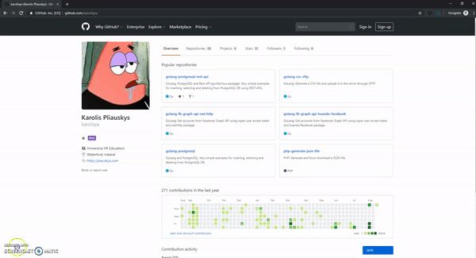

# Simple chrome extension retrieving quotes from https://inspirobot.me

---

**Getting Started with Google Extensions:** https://developer.chrome.com/extensions/getstarted

## Usage
- Clone this repository.
- Open `chrome://extensions` in your chrome browser.
- In top-right corner of the screen - enable `Developer mode`.
- In top-left corner of the screen - click on `Load unpacked`.
- Navigate to the cloned folder from step #1 and select it.
- You should now see https://inspirobot.me icon in your browser's extensions' bar. Every time you click on the icon - new request will be made to https://inspirobot.me and the image from response will be displayed in the popup.
